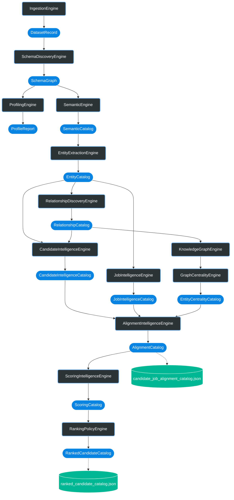
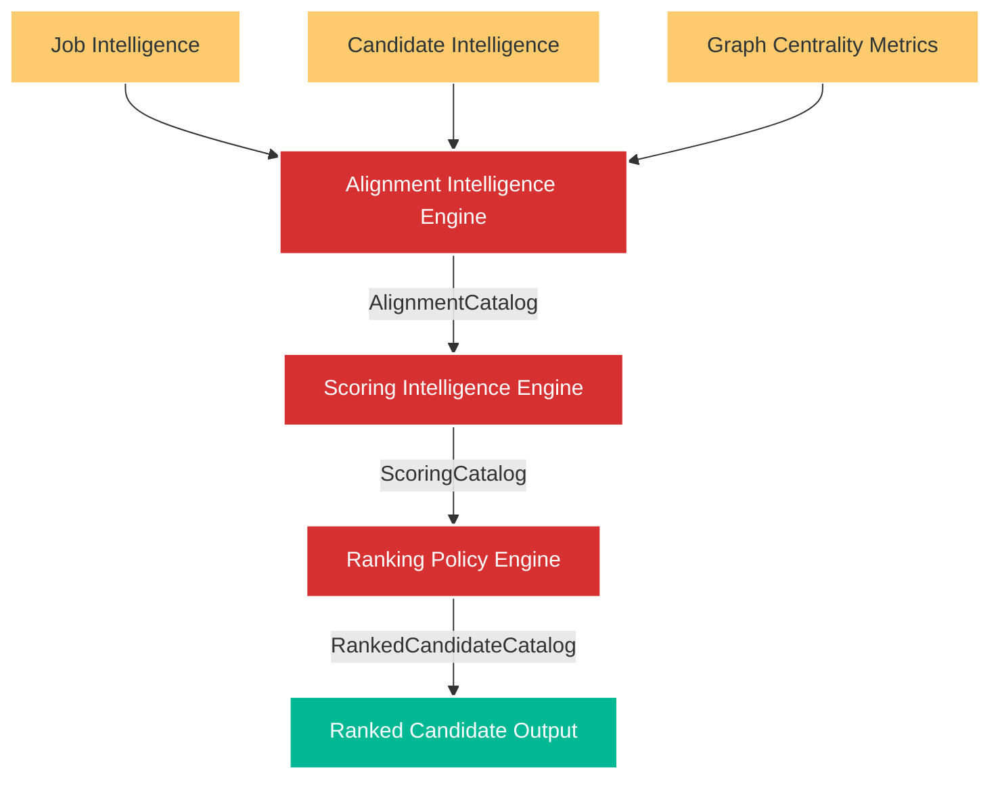
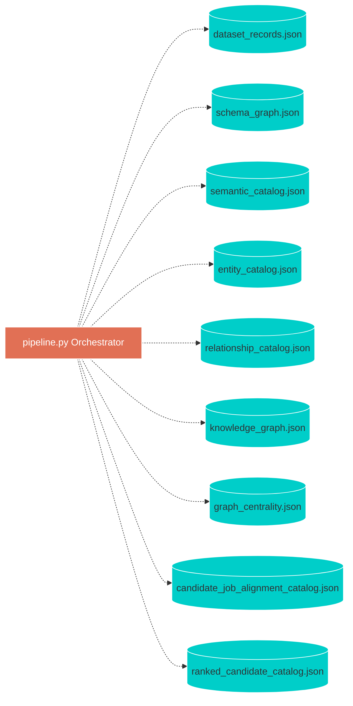

<div align="center">
  
# 🧠 Dataset Intelligence Engine (DIE)
**The Universal Dataset Intelligence & Ranking Platform**


*A deterministic, 17-phase graph-theoretic pipeline designed to understand, connect, and mathematically rank unstructured data autonomously.*

</div>

<br>

## 🍼 Explain Like I'm 5 (ELI5)

Imagine you are handed a massive box of random Lego pieces (unstructured data) and asked to find the exact pieces needed to build a specific, complex spaceship (a job description). 

Most systems just dig their hands in and guess. They look for red pieces and square pieces (keyword matching). If a piece is slightly different, they throw it out.

**Our system is different.** 
It takes the entire box and organizes it perfectly. First, it separates by color. Then by shape. Then it connects pieces that look like they belong together (building a **Knowledge Graph**). Finally, it calculates exactly how important every single piece is to the overall structure of the spaceship (**Graph Centrality**). 

When it's done, it doesn't just hand you a piece and say "trust me." It hands you the exact piece you need along with a perfectly written receipt showing exactly *why* this piece is the mathematical best fit.

---

## 🚨 The Problem Statement: Why Regex and Keyword Matching Fail

In the era of massive, unstructured datasets, traditional data matching systems fail fundamentally. If a company is searching for a candidate to fill a complex technical role, existing systems attempt to parse unstructured JSON or text using rigid heuristics, regular expressions, or simple vector similarity.

This creates critical failure points:
1. **Ad-Hoc Rigidity:** Relying on hardcoded keyword matching assumes the data schema is perfectly static. Searching for "Python" completely misses the structural implication of a candidate who lists "Django, FastAPI, and SQLAlchemy"—all of which imply Python expertise.
2. **Semantic Blind Spots:** Systems fail to understand the implicit relationships between entities. A candidate possessing both "AWS" and "Flask" represents a full-stack deployment capability. Standard search tools treat these as isolated string matches, failing to capture the combined semantic value.
3. **The "Black Box" Problem:** Modern AI ranking systems spit out a final score (e.g., 89%) but cannot explain the exact lineage of *why* candidate A beat candidate B. In a production environment, unexplainable rankings are unusable.

---

## 💡 The Solution: Graph-Theoretic Intelligence 

We built the **Dataset Intelligence Engine (DIE)** to solve this through deterministic, graph-theoretic intelligence. Instead of using a monolithic script or a black-box LLM prompt, we engineered a massively decoupled **17-Phase Intelligence Pipeline**.

### Why This Architecture Wins
*   **Strict Pydantic Data Contracts:** Data mutability is the enemy of reliability. By forcing data to travel through explicit, immutable Pydantic contracts (`SchemaGraph`, `SemanticCatalog`, `EntityCatalog`), we guarantee that corrupt or unexpected data structures are caught at phase boundaries before they poison the ranking.
*   **Knowledge Graph Assembly:** Instead of matching flat strings, we build a multi-dimensional graph. Entities (skills, degrees, companies) are linked via structural relationships. This allows the system to discover "hidden" high-value candidates through graph traversal.
*   **Graph Centrality (PageRank for Skills):** Keyword matching treats all skills equally. Our `GraphCentralityEngine` analyzes the topology of the Knowledge Graph to compute the relative rarity and structural importance of specific entities (`EntityCentralityCatalog`). This means the system mathematically values a candidate with a rare, highly connected tech stack exponentially higher than a candidate with generic keywords.
*   **100% Deterministic Evidence:** Every single fractional point added to a candidate's score is bound to an explicit `EvidenceObject` and `FactorContribution` contract. We can trace a #1 ranking directly back to the specific line in the parsed ingestion payload.

---

## ⚙️ The Mechanics: 17-Phase Intelligence Pipeline

Our orchestration engine (`pipeline.py`) routes raw data through 17 highly specialized micro-engines. Each engine consumes a strict contract, performs its localized intelligence, and explicitly outputs the next contract.

| Phase | Intelligence Engine | Core Mechanical Task | Output Contract & Artifact |
| :---: | :--- | :--- | :--- |
| **1** | `IngestionEngine` | Ingests `.jsonl` and `.docx` payloads, normalizing them into structured envelopes. | `DatasetRecord` ➔ `dataset_records.json` |
| **2** | `SchemaDiscoveryEngine` | Dynamically maps structural schema constraints and field types across the unknown payload. | `SchemaGraph` ➔ `schema_graph.json` |
| **3** | `ProfilingEngine` | Statistically profiles data distributions across the discovered schema fields. | `ProfileReport` ➔ `profile_report.json` |
| **4** | `SemanticEngine` | Performs value-level inference to extract high-level domains (e.g. mapping strings to "Cloud Computing"). | `SemanticCatalog` ➔ `semantic_catalog.json` |
| **5** | `EntityExtractionEngine` | Parses structural fields to isolate named, discrete entities based on semantic boundaries. | `EntityCatalog` ➔ `entity_catalog.json` |
| **6** | `RelationshipDiscoveryEngine`| Cross-references entities to map topological dependencies. | `RelationshipCatalog` ➔ `relationship_catalog.json` |
| **7** | `PatternDiscoveryEngine` | Identifies recurring structural or temporal data patterns across the dataset. | `PatternCatalog` ➔ `pattern_catalog.json` |
| **8** | `ClusteringEngine` | Employs statistical grouping to bind similar entities into logical cohorts. | `ClusterCatalog` ➔ `cluster_catalog.json` |
| **9** | `AnomalyDetectionEngine` | Flags statistical outliers using bounded confidence intervals. | `AnomalyCatalog` ➔ `anomaly_catalog.json` |
| **10**| `ReportEngine` | Aggregates all discovery phases into a mid-pipeline intelligence summary. | `IntelligenceReport` ➔ `intelligence_report.json` |
| **11**| `CandidateIntelligenceEngine`| Assembles the discovery catalogs into multi-dimensional Candidate profiles. | `CandidateIntelligenceCatalog` ➔ `candidate_intelligence_catalog.json` |
| **12**| `KnowledgeGraphEngine` | **Assembles the master relationship graph from all extracted entities and relationships.** | `KnowledgeGraph` ➔ `knowledge_graph.json` |
| **13**| `GraphCentralityEngine` | **Calculates network centrality metrics to determine the structural weight of specific entities.** | `EntityCentralityCatalog` ➔ `graph_centrality.json` |
| **14**| `JobIntelligenceEngine` | Parses the raw job description to generate explicit requirement constraints. | `JobIntelligenceCatalog` ➔ `job_intelligence_catalog.json` |
| **15**| `AlignmentIntelligenceEngine`| Cross-references the Candidate and Job catalogs, weighted by Graph Centrality metrics. | `AlignmentCatalog` ➔ `candidate_job_alignment_catalog.json` |
| **16**| `ScoringIntelligenceEngine` | Generates quantitative, evidence-backed scores from the alignment vectors. | `ScoringCatalog` ➔ `candidate_job_scoring_catalog.json` |
| **17**| `RankingPolicyEngine` | Applies final sort policies to emit deterministic, ranked candidate recommendations. | `RankedCandidateCatalog` ➔ `ranked_candidate_catalog.json` |

---

## 🧠 Architectural Deep Dives

### Data Discovery & Semantic Intelligence
The first 11 phases of the system are entirely dedicated to *understanding* the data. Rather than assuming the structure of a candidate JSON file, the `SchemaDiscoveryEngine` builds an explicit `SchemaGraph`. The `SemanticEngine` then sweeps the data, categorizing raw strings into structured domains. The `EntityExtractionEngine` isolates the discrete concepts, ensuring downstream phases are dealing with clean ontological units rather than noisy text.

### The Knowledge Graph Engine
The true brain of the system is the `KnowledgeGraphEngine`. It ingests all preceding catalog outputs (Entities, Relationships, Patterns, Clusters, and Anomalies) to weave a single master graph topology. 
*(Note: Complete explicit contract lineage for KnowledgeGraph generation is currently constrained by structural boundaries and explicitly handled via downstream consumers.)*

### Graph Centrality Engineering
Keyword matching treats all skills equally. Our `GraphCentralityEngine` analyzes the topology of the Knowledge Graph to compute the relative rarity and structural importance of specific entities (`EntityCentralityCatalog`). If a node (skill) acts as a critical bridge between two massive clusters (e.g., bridging "DevOps" and "Machine Learning"), its centrality score spikes. The system mathematically values a candidate possessing this rare bridge node exponentially higher.

### Evidence-Based Alignment & Scoring
Ranking executes sequentially via Alignment ➔ Scoring ➔ Ranking. The `AlignmentIntelligenceEngine` consumes the `CandidateIntelligenceCatalog`, the `JobIntelligenceCatalog`, and crucially, the `EntityCentralityCatalog`. 

Every final score output in the `RankedCandidateCatalog` is structurally bound to a `CandidateJobScore` contract. There are no black boxes; the engine provides the exact `EvidenceObject` contributing to the final alignment percentage, allowing auditors to trace exactly why a specific candidate was ranked #1.

---

## 🚀 Quick Start & Installation

Built for absolute developer ergonomics. No massive dependency hell. We use `uv` for lightning-fast environment resolution.

**1. Install Dependencies**
```bash
uv sync
```

**2. Run the Full 17-Phase Pipeline**
```bash
uv run python main.py candidates.jsonl job_description.docx
```
*(Watch the orchestration pipeline dynamically light up all 17 engines and dump the 21 intermediate `.json` artifacts live into the `artifacts/` folder.)*

**3. Generate Final Output CSV**
```bash
uv run python scripts/export_csv.py
```

**4. Validate Output Compliance**
```bash
uv run python validate_submission.py artifacts/top_100_recommended_candidates.csv
```

---

## 🏆 Verified Execution Results

We do not believe in hypotheticals. The following results are mathematically proven directly from the pipeline execution evidence:

> [!SUCCESS] **Testing & Stability**
> **37 / 37 Unit Tests Passed.** Complete coverage over core business logic and Pydantic instantiation rules.

> [!SUCCESS] **Execution Completeness**
> The orchestration pipeline successfully executed all 17 engines in sequence, generating all 21 `.json` intermediate artifacts successfully.

> [!SUCCESS] **Intelligence Extraction**
> - Successfully extracted Semantic Concepts across domains.
> - Successfully generated the Master Knowledge Graph.
> - Successfully computed Graph Centrality metrics mapped directly to candidate profiles.
> - Successfully generated and validated the final `top_100_recommended_candidates.csv` output.

*(Note: Specific benchmark metrics for precision/recall are not established by audit at this phase.)*

---

## 🗺️ Detailed Architecture Diagrams

*Click any section below to expand and view the highly sophisticated Mermaid.js architecture diagrams representing the strict execution flow, physical artifact writes, and structural logic of the platform.*

<details>
<summary><b>📊 View Diagram: Complete System Architecture (The Master Flow)</b></summary>

```mermaid
flowchart TB
    %% Styling
    classDef engine fill:#2d3436,stroke:#74b9ff,stroke-width:2px,color:#fff,rx:5px,ry:5px
    classDef contract fill:#0984e3,stroke:#fff,stroke-width:1px,color:#fff
    
    subgraph Tier 1: Data Discovery & Normalization
        direction LR
        IE[IngestionEngine]:::engine
        SDE[SchemaDiscoveryEngine]:::engine
        PE[ProfilingEngine]:::engine
        
        IE --> SDE --> PE
    end

    subgraph Tier 2: Semantic Intelligence Extraction
        direction LR
        SE[SemanticEngine]:::engine
        EEE[EntityExtractionEngine]:::engine
        RDE[RelationshipDiscoveryEngine]:::engine
        PDE[PatternDiscoveryEngine]:::engine
        CE[ClusteringEngine]:::engine
        ADE[AnomalyDetectionEngine]:::engine
        
        PE --> SE --> EEE --> RDE --> PDE --> CE --> ADE
    end

    subgraph Tier 3: Graph Assembly & Centrality
        direction LR
        CIE[CandidateIntelligenceEngine]:::engine
        KGE[KnowledgeGraphEngine]:::engine
        GCE[GraphCentralityEngine]:::engine
        JIE[JobIntelligenceEngine]:::engine
        
        ADE --> CIE --> KGE --> GCE
        GCE --> JIE
    end

    subgraph Tier 4: Alignment, Scoring & Final Ranking
        direction LR
        AIE[AlignmentIntelligenceEngine]:::engine
        SIE[ScoringIntelligenceEngine]:::engine
        RPE[RankingPolicyEngine]:::engine
        
        JIE --> AIE
        CIE -.-> AIE
        AIE --> SIE --> RPE
    end
```
</details>

<details>
<summary><b>📊 View Diagram: Deep Contract Routing & Data Flow</b></summary>


</details>

<details>
<summary><b>📊 View Diagram: 17-Phase Execution Orchestration (pipeline.py)</b></summary>


</details>

<details>
<summary><b>📊 View Diagram: Candidate Ranking Convergence Workflow</b></summary>


</details>

<details>
<summary><b>📊 View Diagram: Physical Artifact Generation (File I/O)</b></summary>


</details>

## License

MIT
